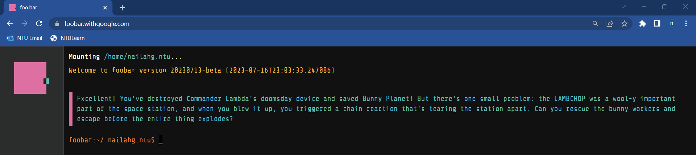

# google-foobar-challenges

Putting the questions and answers here for my review.

### What is Google Foobar?

Google Foobar is an online coding challenge and recruiting tool used by Google to identify and engage with talented programmers and software developers. It was an invitation-only program that appeared to individuals who search for some specific keywords related to coding.

When a user encountered the Google Foobar challenge, they would see a mysterious message inviting them to "Join the ranks of top engineers" and to "Get hired by top companies". Upon accepting the invitation, the user would be presented with a series of progressively difficult coding problems across various domains, such as algorithms, data structures, and software engineering.

The challenges are presented in a command-line interface (CLI) style, and participants could use any programming language of their choice to solve the problems. The problems ranged from relatively simple to highly complex, requiring problem-solving skills and algorithmic thinking.

One of the unique aspects of Google Foobar was that successful participants were reportedly contacted by Google recruiters, who would then initiate conversations about potential job opportunities at Google. (Fingers crossed 🤞)

### List of Questions

| Level | Name | Link |
|-------|------|------|
|1|Minion Work Assignments|[HERE](level-1/minion-work-assignments)|
|2|Don't Get Volunteered|[HERE](level-2/dont-get-volunteered)|
|2|Please Pass The Coded Messages|[HERE](level-2/please-pass-the-coded-messages)|
|3|Prepare The Bunnies Escape|[HERE](level-3/prepare-the-bunnies-escape)|
|3|Doomsday Fuel|[HERE](level-3/doomsday-fuel)|
|3|Bomb Baby|[HERE](level-3/bomb-baby)|
